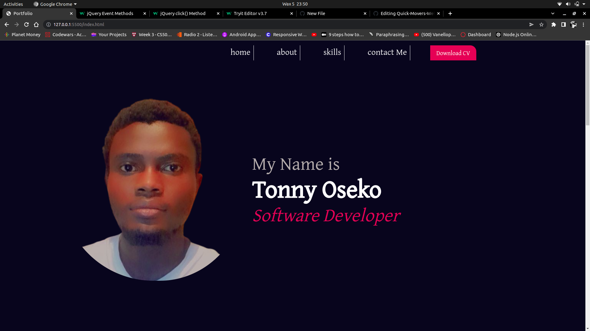

# portfolio
A site designed to showcase my skills, goals, and accomplishments.

## Table of Contents
---------------------

 * Introduction
 * Requirements
 * Installation
 * Troubleshooting
 * Contributing
 * Licence
 * Acknowledgements

## Requirements
  * HTML
  * CSS
  * JavaScript

## Installation
  clone the repository from Github using the "git clone <url> command"
  open the project on the local machine
  Run the index.html file on the browser of your choice
  
## Contact
  * Reach out to tonnyseko@gmail.com for requests to contribute on the project

## Contributing
Pull requests are welcome. For major changes, please open an issue first to discuss what you would like to change.

Please make sure to update tests as appropriate.

## License
[MIT](https://choosealicense.com/licenses/mit/)
  
## Acknowledgements
  Font Awesome
  Google Fonts
  Flat Icon
  VS Code editor
